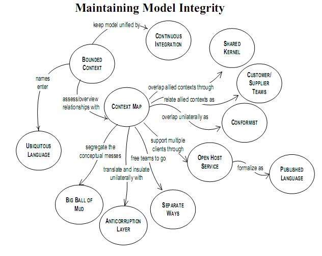
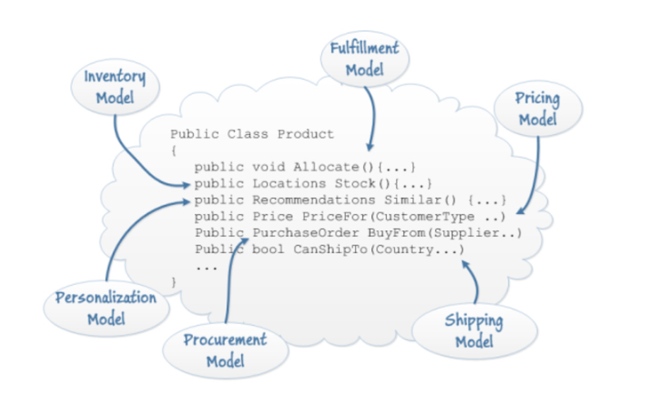
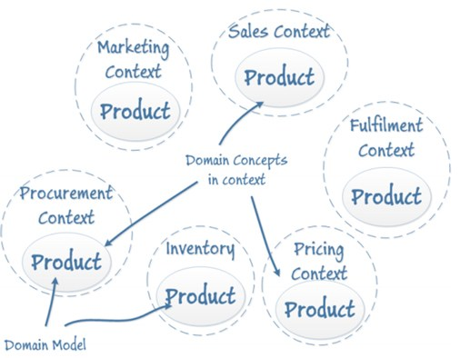
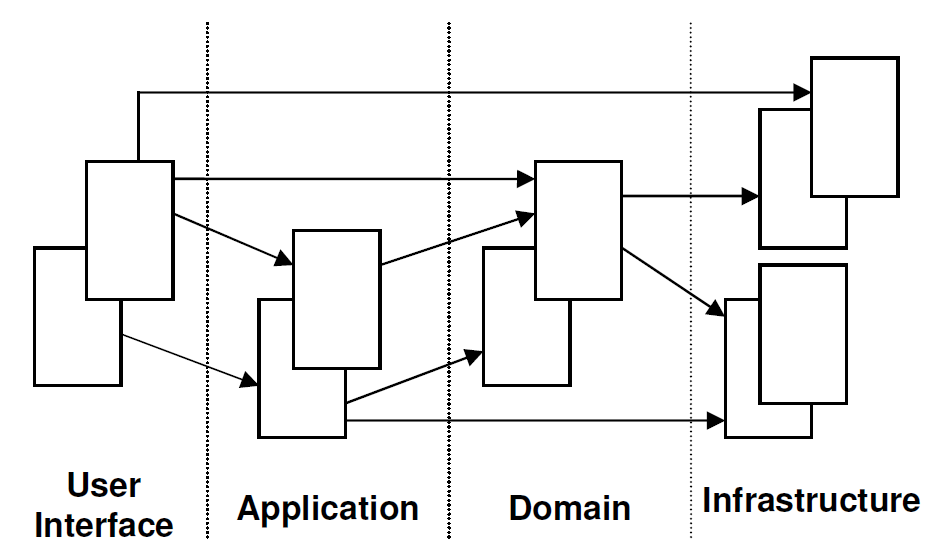

# Domain-Driven Design

O termo Domain-Driven Design, ou simplesmente DDD, foi criado por Eric Evans em seu livro: "Domain-Driven Design: Tackling Complexity in the Heart of Software", sendo uma abordagem de modelagem de software que segue um conjunto de princípios e práticas que possuem o objetivo de facilitar a implementação de regras e processos de negócios, que tratamos como **domínio**.

*Domain Driven Design* como o nome já diz é sobre *design*. *Design* guiado pelo domínio, ou seja, o mais importante em um software não é o seu código, nem sua arquitetura, nem a tecnologia sobre a qual foi desenvolvido, mas sim o problema que o mesmo se propõe a resolver, ou em outras palavras, a regra de negócio. Ela é a razão do software existir, por isso deve receber o máximo de tempo e atenção possíveis. Em praticamente todos os projetos de software, a complexidade não está localizada nos aspectos técnicos, mas sim no negócio, na atividade que é exercida pelo cliente ou problema que o mesmo possui. Como já diz o título do livro de Eric Evans, esse é o "coração", o ponto central de qualquer aplicação, portanto todo o resto deve ser trabalhado de forma que o negócio seja entendido e concebido da melhor forma possível.

## Implementação

Não existe um modelo passo-a-passo de como implementar o DDD, mas podemos tentar criar um resumo básico:

### Passo #1 – Entender o Negócio

Sem entender o negócio não tem como implementar o DDD. Em um projeto existem basicamente dois tipos de papéis, o Time de Desenvolvimento e os Domain Experts. Os Domain Experts entendem do negócio e vão guiar o time de desenvolvimento no projeto tirando dúvidas, definindo regras e processos e nomeando os termos a serem utilizados.

### Passo #2 – Extrair a Linguagem Ubíqua

A Linguagem Ubíqua é uma linguagem compartilhada e desenvolvida pela equipe de Domain Experts e de Desenvolvimento. A Linguagem Ubíqua é a linguagem do negócio dentro da empresa e todos devem fazer uso dela para expressar corretamente todos processos e intenções de negócio.

### Passo #3 – Modelagem Estratégica

Extrair a Linguagem Ubíqua vai colaborar na visão e entendimento do negócio e como segregar seu domínio em partes menores e responsáveis. Veja na figura abaixo um exemplos de Context Map:

Para documentar estas segregações responsáveis utilizamos o Mapa de Contextos, ou em inglês, **Context Map** que pode ser representado através de imagens e uma simples documentação do tipo de relacionamento entre os contextos.

Além de delimitar os contextos a modelagem estratégica engloba outros conceitos como *Sub-Domain*, *Shared Kernel*, *Customer/Supplier*, *Conformist*, *Anti-Corruption Layer*, *Separate Ways*, *Open Host Service* e *Published Language*.

Para a aplicação ter um bom design, uma fácil manutenção e extensibilidade e o domínio ser bem modelado é necessário focar em modelagem estratégica e para isso é importante preocupar-se com a integridade do modelo conforme o diagrama do Context Map apresenta.

Todos os conceitos do Context Map são importantes, é necessário compreender muito bem de cada um deles para termos condição de realizar uma boa modelagem.

#### Big Ball of Mud

Este conceito aborda vários aspectos negativos de sua aplicação, desde código macarrônico que fere os princípios do SOLID e Clean Code até uma entidade com muitas responsabilidades em um único contexto. Analise a imagem a seguir:

A entidade *Produto* possui diversos comportamentos, cada um destes comportamentos está ligado a uma intenção da aplicação, todas as intenções são relativas ao produto em si, porém imagine a complexidade desta classe, quantas equipes de desenvolvimento estão compartilhando a mesma classe em comum.

A entidade *Produto* atende aspectos de *Aquisição*, *Venda*, *Entrega*, *Estoque* e etc. Esse tipo de modelagem pode ser considerada um exemplo de *Big Ball of Mud*, pois qualquer manutenção nessa entidade pode ocasionar impactos sérios em diversos pontos da aplicação, é praticamente impossível de gerenciar as mudanças.

O DDD não é sobre dividir a aplicação em camadas responsáveis, o DDD é sobre modelar corretamente o domínio do seu negócio. Se sua aplicação possui uma única camada de domínio e esta camada concentra todas as entidades do seu negócio você pode estar cometendo um grande erro de modelagem de domínio. Para aplicações que possuem domínios muito complexos o ideal é aplicar o conceito de **Bounded Context**.

#### Bounded Context

Os contextos delimitados ou em inglês **bounded contexts** buscam delimitar o seu domínio complexo em contextos baseados nas intenções do negócio. Isto significa que você deve delimitar as intenções de suas entidades com base no contexto que ela pertence. Analise a imagem a seguir:

O domínio foi subdividido em seis pedaços, ou melhor, em seis *bounded contexts*, um para cada intenção de negócio (*Vendas*, *Entregas*, *Estoque* etc.). Agora cada *bounded context* possui uma entidade *Produto*. Cada versão da entidade *Produto* é diferente nos seis *bounded contexts* existentes. A entidade *Produto* possui comportamentos que atendem necessidades específicas de seu *bounded context*, a única coisa em comum entre todas as entidades *Produto* é sua identidade, o *ProdutoId* no caso. A identidade em comum vai ajudar na persistência e na comunicação entre os *bounded contexts*.

Mudando um pouco de cenário imagine uma entidade chamada *Funcionário*, esta entidade representa o colaborador da empresa dentro da aplicação. No bounded context "Recursos Humanos" a entidade *Funcionário* possui uma modelagem que atende comportamentos como *férias*, *salário*, *rescisão* etc. No *bounded context* "TI" esta entidade possui uma modelagem que atende comportamentos como *login*, *troca de senha*, *permissões* etc.

Quando se pergunta sobre um *funcionário* no departamento de TI este está ligado a um usuário e suas responsabilidades dentro do sistema, quando se pergunta sobre um *funcionário* dentro do RH este está ligado a um colaborador da empresa. É a mesma pessoa, porém dentro da aplicação possui intenções diferentes e é baseada nas intenções que o seu domínio deve ser delimitado em contextos. Não tem necessidade nenhuma a entidade *Funcionário* do o *bounded context* de TI ter acesso a *salário*, *reajustes* e etc.

> **Note**\
> Os *Bounded Contexts* fornecem aos membros das equipes de desenvolvimento um claro entendimento do que deve ser consistido e desenvolvido independentemente.
>
> Representar a mesma entidade em diversos *bounded contexts* não é duplicar o código. Duplicar código é ter a mesma responsabilidade em trechos de código diferentes. Neste caso existe uma segregação de comportamentos e intenções de uma entidade conforme o contexto em que ela está. Não importa se a entidade é persistida na mesma tabela ou em tabelas diferentes, neste caso ambos os cenários são aceitos.

**Características importantes de um bounded context:**

- Cada *bounded context* pode possuir sua própria abordagem de arquitetura e tecnologias. Camadas de aplicação, persistência, infra-estrutura e etc.
- Os *bounded contexts* podem se comunicar entre si de diversas maneiras, inclusive utilizando eventos de domínio *"Domain Events"* conectados em um *"Event Bus"*.
- Cada *bounded context* possui sua própria linguagem Ubiqua.
- Cada *bounded context* pode ser desenvolvido por um time de desenvolvedores diferente. Não existe necessidade de um único time conhecer a implementação de todos os contextos.

**Patterns que descrevem o tipo de relacionamento entre os bounded contexts:**

Existem diversos patterns que descrevem o tipo de relacionamento entre os *bounded contexts*:

- `Shared Kernel`: Um contexto compartilhado entre outros contextos, o shared kernel é um tipo de contexto onde N *bounded contexts* dependem dele, uma espécie de Core, este tipo de contexto não pode ser alterado sem consultar todos os times de desenvolvimento que dependem dele.

- `Customer/Supplier`: Contextos `customer` dependem de contextos `supplier`. A equipe `downstream` atua como cliente (`customer`) da equipe `upstream` (`supplier`). As equipes definem testes de aceitação automatizados que validam as interfaces que a equipe `upstream` fornecem. A equipe `upstream` pode então fazer alterações em seu código sem medo de quebrar alguma coisa da equipe `downstream`.

- `Conformist`: É o cenário onde as equipes `downstream` e `upstream` não estão mutuamente alinhadas e a equipe `downstream` precisa atender o negócio com o que a equipe `upstream` fornece mesmo não estando de acordo com as necessidades. A equipe `downstream` precisa aceitar este fato, se conformar com isto.

- `Partner`: Neste cenário duas equipes possuem dependências mútuas em seus contextos e precisam somar esforços de modelagem para se atenderem mutuamente.

- `Anti Corruption Layer`: Neste cenário a equipe `downstream` desenvolve uma camada adicional anti-corrupção para se comunicar com o contexto `upstream`, é o cenário típico onde o `supplier` é um sistema legado ou uma API mal desenvolvida.

### Passo #4 – Definir a Arquitetura

Para que possamos atingir o principal objetivo do DDD, que é focar no domínio da aplicação, é necessário que a arquitetura da mesma seja pensada de forma a permitir essa distinção. Pensando nisso é que o DDD sugere uma arquitetura padrão de 4 camadas (*Presentation*, *Application*, *Domain* e *Infra*), que tem como objetivo principal separar o modelo do domínio da tecnologia em si, facilitando assim eventuais mudanças nas regras de negócio da aplicação.

Muitas aplicações possuem regras de negócio espalhadas por todo o código, desde *stored procedures* na base de dados até *JavaScripts* na interface do usuário. O grande problema é que alterar alguma dessas regras se torna um verdadeiro pesadelo, uma vez que o desenvolvedor precisará literalmente rastrear todos os locais onde ela deve ser modificada, efetuar as alterações propriamente ditas, e por fim planejar a instalação de todos os componentes modificados.

Para evitar esse tipo de problema, devemos isolar todo o código responsável por controlar o domínio de maneira que ele tenha uma única responsabilidade: implementar regras de negócio. Essa camada deve ser o principal local modificado quando alguma regra da aplicação tiver que ser alterada. Vejamos cada camada:

- `User Interface Layer`: Responsável pela interação com o usuário, seja interpretando comandos ou exibindo informação para o mesmo.

    > **Mais detalhes**
    >
    > - **Dependência**
    >     - Depende da camada de aplicação
    > - **Conteúdo**
    >     - Aplicação Desktop (WinForms)
    >     - Aplicação Web (Angular, React, Vue)
    >     - Aplicação Mobile (Android)

- `Application Layer`: Coordena as atividades da aplicação, porém, não contém regras de negócio. Pode, por exemplo, manter um estado de determinada transação. Essa é a camada mais discutida, pois dependendo do domínio da aplicação, ela pode não ser necessária.

    > **Mais detalhes**
    >
    > - **Dependência**
    >     - Depende da camada de domínio, portanto pode:
    >         - Usar objetos da entidade
    >         - Usar interfaces/contratos de repositórios
    >     - Depende da camada de infraestrutura (através de DI), portanto pode:
    >         - Usar classes de implementação de repositórios (idealmente através de DI).
    > - **Conteúdo**
    >     - Serviços de aplicação
    >     - Interfaces/contratos e implementação da API
    >         - e.g. *Controllers*
    >     - *DataTransferObjects (DTO)*
    >     - Mapeamento entre objetos da camada de aplicação e domínio
    >         - e.g. *AutoMapper*
    >     - *Commands*, *command handler* e *Queries* (quando usado com abordagem CQS)
    >         - e.g. Micro ORMs como *Dapper*
    >     - Resolução do mapeamento do container IoC/DI
    >         - e.g. .NET

- `Domain Layer`: Essa camada concentra toda a regra de negócio da aplicação. Essa deve ser a sua única preocupação, delegando qualquer outro tipo de atividade para as demais camadas;

    > **Mais detalhes**
    >
    > - **Dependência**
    >     - Idealmente não deve depender de nenhuma outra camada.
    >         - Possui apenas dependências indiretas através de interfaces/contratos
    > - **Conteúdo**
    >     - Entidades de Domínio
    >     - *Value Object (VO)*
    >     - Interfaces/contratos de repositórios
    >     - Serviços de domínio
    >     - Eventos de domínio
    >     - Validações

- `Infrastructure Layer`: É a camada de mais baixo nível, responsável por prover serviços como persistência e envio de email, ou seja, dar o suporte tecnológico para as demais camadas;

    > **Mais detalhes**
    >
    > - **Dependência**
    >     - Depende da camada de domínio, portanto pode:
    >         - Usar objetos da entidade
    >             - e.g. EF atualizando um banco através de entidades mapeadas
    >     - Depende diretamente de frameworks de infraestrutura
    >         - e.g. Frameworks de persistência, cache ou API.
    > - **Conteúdo**
    >     - Implementação de repositórios
    >     - Persistência
    >         - e.g. Entity Framework
    >     - Controle de versionamento do banco
    >         - e.g. *Migrations*
    >     - *DataModel* (Mapeamento)
    >     - *Logging*, criptografia, etc.

A figura abaixo mostra o relacionamento entre as camadas:

Tendo uma clara visão do `Context Map` é possível trabalhar na definição da arquitetura. Cada contexto pode possuir uma arquitetura independente dos demais, não é necessário impor o mesmo estilo arquitetural para todos os contextos.

O DDD não prega a necessidade de uma arquitetura de 4 camadas, pelo contrário, o arquiteto tem a liberdade de definir o melhor estilo arquitetural para atender a necessidade da aplicação, podendo utilizar modelos simples de 3 camadas como o *Table Module Pattern*.

Existem diversos estilos arquiteturais como a clássica Arquitetura Cebola, Arquitetura Hexagonal proposta pelo Vernon em seu livro "Implementing Domain Driven Design" ou até mesmo os populares Microservices. Alguns destes estilos inclusive podem fazer uso de patterns como CQRS, Event Sourcing, etc.

### Passo #5 – Modelagem Tática

Quando o assunto é DDD a modelagem tática fica por conta do **Domain Model Pattern** que é uma abordagem de como escrever as classes que vão mapear os modelos do mundo real e implementar os comportamentos do negócio. O *Domain Model Pattern* deve ser isolado dos detalhes da sua arquitetura como persistência e etc.

O Eric Evans não criou os patterns utilizados no *Domain Model*, apenas fez o uso correto deles criando então esta abordagem de modelagem tática que incluem os seguintes componentes:

- `Entity`: Objeto identificado por sua identidade e não por seus atributos. Por exemplo, a representação de uma pessoa em software geralmente conta com atributos como nome, data de nascimento, CPF, RG etc. Porém, como podemos distinguir cada pessoa unicamente? Pelo nome e data de nascimento com certeza não, pois muitas pessoas nascem em um mesmo dia e podem existir pessoas com o mesmo nome também. CPF e RG podem ser usados, se levarmos em conta apenas cidadãos brasileiros. A principal ideia é que cada pessoa deve ser única, não sendo possível criar uma pessoa igual apenas "copiando" os atributos de outra.

- `Value Object`: Um objeto que agrega valor às entidades. Não possui identidade definida e é imutável. A identidade é o conjunto de seus próprios atributos (e.g. email, endereço).

- `Aggregate Root (ou Aggregate Object)`: Um Aggregate é um grupo de objetos que devem ser tratados como um só, cujo agrupamento representa uma unidade maior no contexto do domínio. Já um Aggregate Root é uma entidade que é a raiz agregadora de um processo do domínio que envolve mais de uma entidade. A raiz de um Aggregate é o único objeto do mesmo que é acessível para os demais objetos. É por ele que todos devem navegar a fim de acessar os objetos internos.

- `Domain Model`: Uma entidade do domínio, possui estados e comportamentos, lógica de negócio, getters e setters AdHoc, etc.

- `Domain Service`: Serviço do domínio que atende partes do negócio que não se encaixam em entidades específicas, trabalha com diversas entidades, realiza persistência através de repositórios e etc.

    Um serviço de domínio é frequentemente usado sempre que uma determinada operação deve acessar mais de uma raiz agregada. Muitos diriam que cada operação deve atualizar apenas uma única raiz agregada, mas nem sempre é possível. Especialmente diante de mudanças de requisitos em um aplicativo existente. Se necessário, um serviço de domínio deve ser usado em vez de as raízes agregadas acessarem umas às outras.

- `Factory`: Classe responsável por construir adequadamente um objeto ou entidade. Encapsula a lógica de criação de objetos, tirando essa "carga" do objeto em si.

- `Application Service`: Serviço de aplicação que orquestra ações disparadas pela camada de apresentação e fornece DTOs para comunicação entre as demais camadas e para o consumo da camada de apresentação.

    Operam em tipos escalares, transformando-os em tipos de Domínio. Um tipo escalar pode ser considerado qualquer tipo desconhecido para o Modelo de Domínio. Isso inclui tipos primitivos e tipos que não pertencem ao Domínio.

    Embora esses serviços não devam ter "lógica de negócios", eles certamente podem realizar uma série de etapas necessárias para atender a uma necessidade do aplicativo. Normalmente, a camada de serviço de aplicativo fará chamadas para os serviços de infraestrutura, serviços de domínio e entidades de domínio para realizar o trabalho.

    Como o Application Service orquestra o fluxo de trabalho do aplicativo, não faria sentido que eles fossem chamados pelo Serviço de Domínio ou mesmo por eles mesmos. Um fluxo de trabalho tem apenas um único ponto de partida; se um serviço de aplicativo pudesse ser chamado por outras entidades dentro do modelo de domínio, isso implicaria que um fluxo de trabalho tem um número indeterminado de pontos de partida.

- `Repository`: Uma classe que realiza a persistência das entidades se comunicando diretamente com o meio de acesso aos dados, é utilizado **apenas um repositório por agregação**. Abstrai o acesso à fonte de dados, provendo uma interface similar a uma coleção que pode ser facilmente manipulada pelos objetos do domínio.

- `Infrastructure Service (ou External Service)`: Serviço externo que realiza a consulta ou persistência de informações por meios diversos. Esses são serviços que normalmente se comunicam com recursos externos e não fazem parte do domínio principal do problema.

    Ao tentar categorizar um serviço de infraestrutura, podemos nos fazer as seguintes perguntas:
        - Se removermos este serviço, isso afetará a execução do meu modelo de domínio?
        - Se removermos este serviço, isso afetará a execução do meu aplicativo?

    Se isso afetará nosso modelo de domínio, provavelmente é um "Serviço de Domínio". Se, no entanto, ele simplesmente afetará nosso aplicativo, provavelmente é um serviço de infraestrutura. Portanto, por exemplo, se retirarmos as notificações por email de um aplicativo, isso provavelmente não afetará o modelo de domínio central do aplicativo; no entanto, quebraria completamente a usabilidade do aplicativo, portanto, é um serviço de infraestrutura (e não um serviço de domínio).

    O serviço de infraestrutura só pode ser invocado pelo serviço de aplicativo. Se os serviços de domínio ou as entidades de domínio pudessem invocar os serviços de infraestrutura (e.g. logger, e-mail), provavelmente teríamos a lógica do aplicativo vazando em nosso modelo de domínio.

A figura abaixo ilustra o relacionamento entre os principais padrões do DDD:

## Conclusão

O DDD não tenta resolver todos os problemas de todas as camadas de um sistema. Seu foco é na modelagem das entidades principais de negócio usando a linguagem adequada daquele domínio para facilitar a manutenção, extensão e entendimento.

Implementar o DDD em um projeto pode ser uma ótima decisão que proporcionará mais facilidades para atender aos complexos processos de negócio. Tornará a equipe mais colaborativa e focada no que é realmente mais importante.

## Referências

- <https://www.eduardopires.net.br/2016/08/ddd-nao-e-arquitetura-em-camadas/>
- <https://www.devmedia.com.br/ddd-domain-driven-design-com-net/14416>
- <https://www.eduardopires.net.br/2016/03/ddd-bounded-context>
- <https://badia-kharroubi.gitbooks.io/microservices-architecture/content/patterns/tactical-patterns/domain-application-infrastructure-services-pattern.html>
